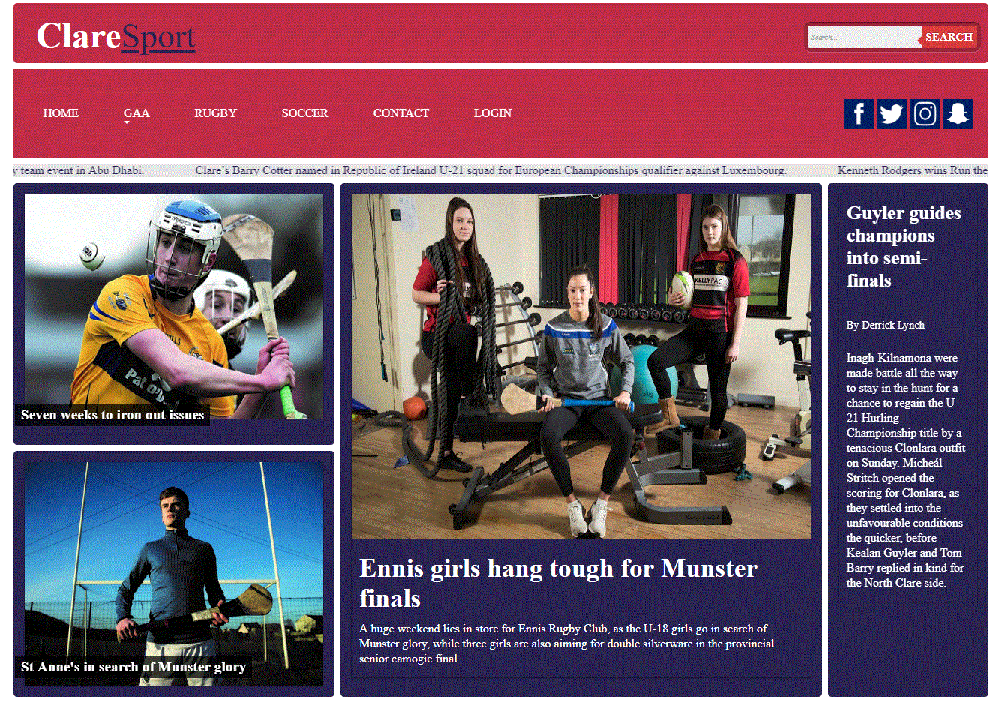
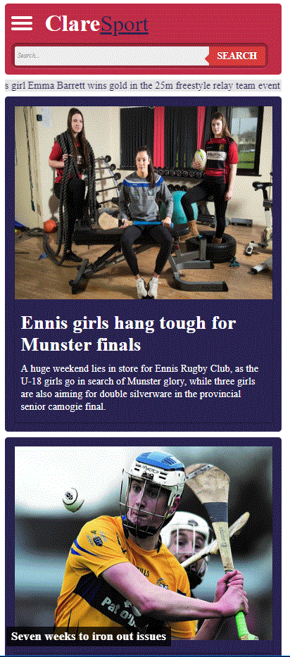
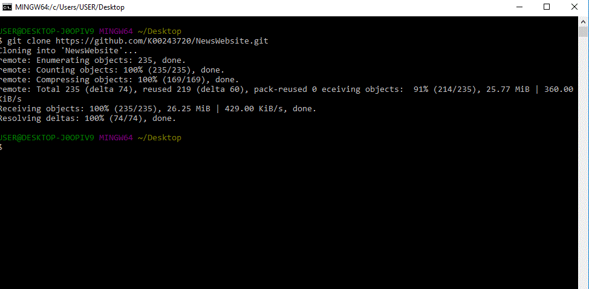

# NewsWebsite

This is a news website that I have produced as part of my H.Dip Creative Multimedia Programming course. I'm brand new to programming, so this has been a huge learning curve. It has been created using HTML5, CSS3 and JQuery.

## Visuals

Grids and how they position on a page was the most difficult learning aspect of this site for me. 

```bash
 .section2 {
    display: contents;
    grid-template-columns: repeat(6, [col] 220px);
    grid-template-rows: repeat(2, [row] auto); }
```

This is how it looks in the end: 


Desktop Site





Mobile Site


                                                                 
                                                                 
## Learning Github 
Learning about Github has also been a part of this project!



## Ackowledgements
As a beginner in responsive web design, I found a Getting Started Guide on CSS Grids by Rachel Andrew (www.gridbyexample.com) to be extremely helpful. I also used Lynda.com a lot, particularly Chris Converse on Creating a Responsive Web Design and Learning Responsive Design with James Williamson. As I had a lot of difficulty with a hamburger menu, I used an excellent guide on Medium in the form of Mark Carron (https://medium.com/@heyoka/responsive-pure-css-off-canvas-hamburger-menu-aebc8d11d793). 